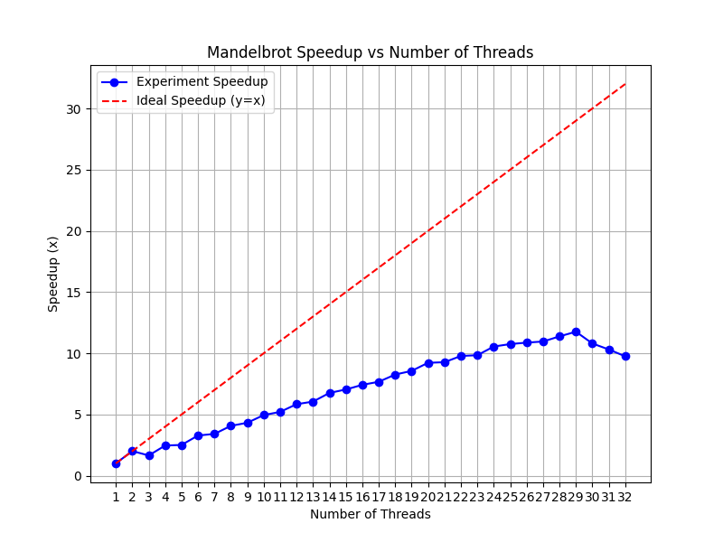
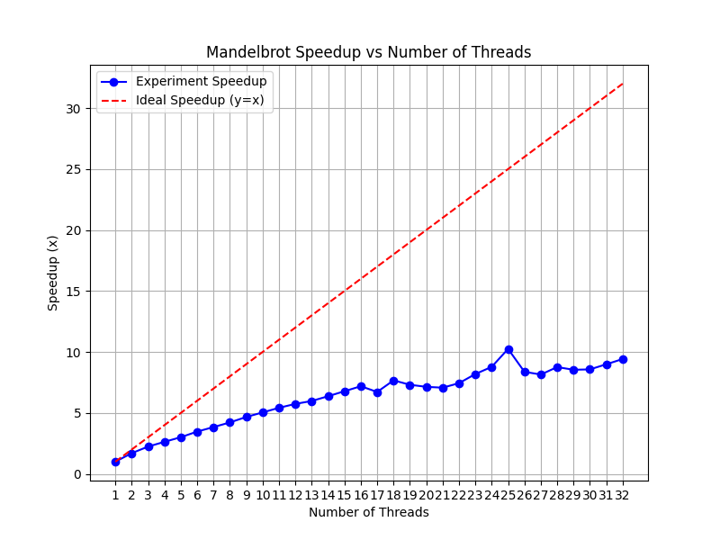
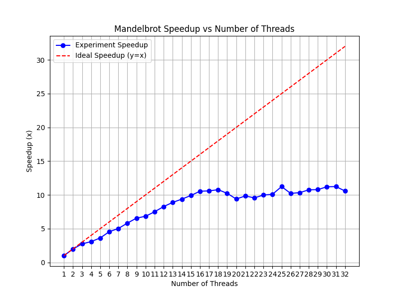
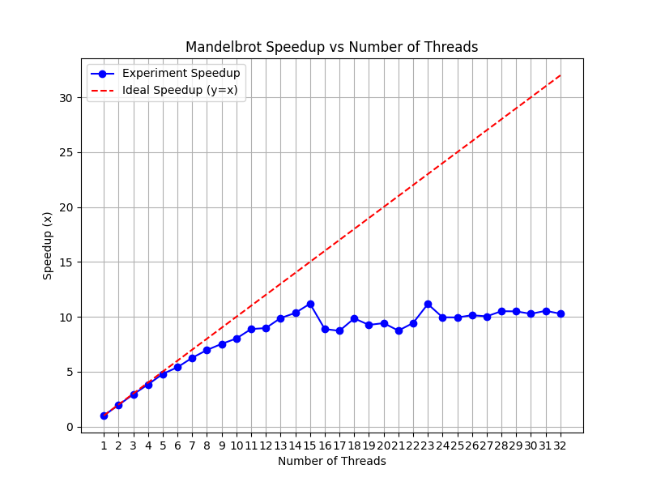

# CS 149 (2024): Assignment 1

>   相关文章：[Stanford-CS149-并行计算-Assignment1-指南 - 知乎](https://zhuanlan.zhihu.com/p/7554656902)

## 环境

```bash
# 系统版本
uname -a
lsb_release -a
```

- OS: Windows11 - wsl2 (6.6.87.2-microsoft-standard-WSL2) - Ubuntu 22.04.5 LTS
- CPU: AMD Ryzen 7 6800H (8 cores, 16 logical processors)
- Python 3.10.12

## Prog1_mandelbrot_threads

由于笔者设备有 8x2 个逻辑处理器，为了实现原实验的效果（4x2 个逻辑处理器，最大 16 线程），将实验最大线程设为 32 线程。

优化前后的实验结果如下，前两张图为**连续等分**，第三张图为**连续不等分**，后两张为**交叉等分**。（具体耗时结果，可见prog1文件夹下csv文件）。










接下来，回答实验中的问题。

首先，针对加速比没有按照线程数的增长，线性增长。甚至，在图一中，3 线程效率低于 2 线程。

这是由于**连续等分**的划分方式，对于**稀疏运算**来说，不同线程的计算量不同，具体地，View 1 的结果如下。

```
NumThread: 3, Thread: 0, Time: 0.084 ms
NumThread: 3, Thread: 1, Time: 0.261 ms
NumThread: 3, Thread: 2, Time: 0.085 ms
```

可以发现 Thread 1 是瓶颈。

因此，我观察到图像上下对称，先尝试了**连续不均等分**，即上下两侧靠外的线程运算的区域大，中间的运算区域小，试图去平衡，各个线程中的计算量，虽然对比**连续等分**有明显进步，但仍然达不到实验要求。

再之后，根据相近的地方，计算量相似，使用**交叉等分**的方式划分，使得在到达 8 线程前几乎都是线性加速，Thread 8 达到 7.35x 的加速比。交叉间隔根据图形不同、线程数不同可以再调优。

不同方法，随着线程超过逻辑处理器后的变化，**连续等分**因为中间的线程负载还是很大，就是根据运算量最大的线程计算量减小而降低，最后到 29 最快，后面可能是因为划分的偏移，又导致峰值变高；**连续不等分**与**交叉等分**都是到超过逻辑处理器数量之后，基本维持在同一个加速比，由于划分的区别而产生波动，或因为切换上下文，性能略下降。

```cpp
// workerThreadStart 函数实现，三种方法
void workerThreadStart(WorkerArgs* const args) {
    // TODO FOR CS149 STUDENTS: Implement the body of the worker
    // thread here. Each thread should make a call to mandelbrotSerial()
    // to compute a part of the output image.  For example, in a
    // program that uses two threads, thread 0 could compute the top
    // half of the image and thread 1 could compute the bottom half.

    // printf("Hello world from thread %d\n", args->threadId);
    double startTime = CycleTimer::currentSeconds();

    // 1. thread 8 => 7.3x speedup
    constexpr unsigned int CHUNK_SIZE = 16;

    for (unsigned int startRow = args->threadId * CHUNK_SIZE;
         startRow < args->height; startRow += args->numThreads * CHUNK_SIZE) {
        int numRows = std::min(CHUNK_SIZE, args->height - startRow);
        mandelbrotSerial(args->x0, args->y0, args->x1, args->y1, args->width,
                         args->height, startRow, numRows, args->maxIterations,
                         args->output);
    }

    // 2. thread 8 => 5.8x speedup
    // int startRow = 0, nowRow = 0, tot = 0;
    // for (int i = 0; i < args->numThreads; i++) {
    //     int j = std::max(i + 1, args->numThreads - i);
    //     tot += j * j;
    //     if (i == args->threadId - 1)
    //         startRow = tot;
    //     else if (i == args->threadId)
    //         nowRow = tot;
    // }
    // double perThread = static_cast<double>(args->height) / tot;
    // startRow = static_cast<int>(startRow * perThread);
    // nowRow = static_cast<int>(nowRow * perThread);
    // int numRows = nowRow - startRow;
    // if (args->threadId == args->numThreads - 1)
    //     numRows = args->height - startRow;
    // mandelbrotSerial(args->x0, args->y0, args->x1, args->y1, args->width,
    //                  args->height, startRow, numRows, args->maxIterations,
    //                  args->output);

    // 3. thread 8 => 4.x speedup
    // int perThread = (args->height - 1) / args->numThreads + 1;
    // int startRow = args->threadId * perThread,
    //     numRows =
    //         std::min(perThread, static_cast<int>(args->height) - startRow);

    // printf("width: %d, height: %d, startRow: %d, numRows: %d\n", args->width,
    //        args->height, startRow, numRows);
    // mandelbrotSerial(args->x0, args->y0, args->x1, args->y1, args->width,
    //                  args->height, startRow, numRows, args->maxIterations,
    //                  args->output);

    double endTime = CycleTimer::currentSeconds();
    printf("NumThread: %d, Thread: %d, Time: %.3lf ms\n", args->numThreads,
           args->threadId, endTime - startTime);
}
```

## Prog2_vecintrin

观察`abs()`函数的实现，不难看出，`maskAll`的初始化存在问题，只有默认值，不能适应多种向量宽度；向量宽度必须是数组长度的因子。

做出如下修改（如需测试，解除`main()`函数中，相关的注释即可）：

```cpp
// void absVector(float* values, float* output, int N);
// All ones
// maskAll = _cs149_init_ones(); // original
maskAll = _cs149_init_ones(std::min(VECTOR_WIDTH, N - i));
```

而后参照`absVector()`函数实现中的`vecintrin`库函数的应用，照猫画虎。

其中值得注意的是标有`corner ???`注释的地方，由于库函数实现中，比较函数，未被`mask`掩盖（为0）时，是沿用**目标数组**的结果，所以会有需要初始化的地方。

建议多次、多试不同的参数，来测试（写个脚本最好，不过我懒了）。

同时也存在实际不影响的未初始化，比如`absVector()`中的`maskIsNegative`，后半部分，其实不是合法的，但是由于只会影响中间结果，不影响最后赋值的情况，所以，不需要额外处理。

```cpp
void clampedExpVector(float* values, int* exponents, float* output, int N) {
    //
    // CS149 STUDENTS TODO: Implement your vectorized version of
    // clampedExpSerial() here.
    //
    // Your solution should work for any value of
    // N and VECTOR_WIDTH, not just when VECTOR_WIDTH divides N
    //
    __cs149_vec_float x, result, oneFloat = _cs149_vset_float(1.f),
                                 ceiling = _cs149_vset_float(9.999999f);
    __cs149_vec_int y, count, zero = _cs149_vset_int(0),
                              oneInt = _cs149_vset_int(1);
    __cs149_mask maskAll, maskEqZero, maskNotEqZero, maskGtCeiling,
        maskCountGtZero;

    for (int i = 0; i < N; i += VECTOR_WIDTH) {
        // 全 1（且未越界）
        maskAll = _cs149_init_ones(std::min(VECTOR_WIDTH, N - i));
        _cs149_vload_float(x, values + i, maskAll);   // x = value[i];
        _cs149_vload_int(y, exponents + i, maskAll);  // y = exponents[i];
        // 等于 0（且未越界）
        maskEqZero = _cs149_init_ones(0);              // init corner ???
        _cs149_veq_int(maskEqZero, y, zero, maskAll);  // if (y == 0) {
        _cs149_vstore_float(output + i, oneFloat,
                            maskEqZero);  // output[i] = 1.f;
        // 不等于 0（且未越界）
        maskNotEqZero = _cs149_mask_not(maskEqZero);  // if (y != 0) {
        maskNotEqZero = _cs149_mask_and(maskNotEqZero, maskAll);  // corner ???
        _cs149_vmove_float(result, x, maskNotEqZero);             // result = x;
        count = _cs149_vset_int(0);                               // init ???
        _cs149_vsub_int(count, y, oneInt, maskNotEqZero);  // count = y - 1;
        maskCountGtZero = _cs149_init_ones(0);             // corner ???
        _cs149_vgt_int(maskCountGtZero, count, zero, maskNotEqZero);
        while (_cs149_cntbits(maskCountGtZero) > 0) {  // while (count > 0) {
            _cs149_vmult_float(result, result, x,
                               maskCountGtZero);  // result *= x;
            _cs149_vsub_int(count, count, oneInt, maskCountGtZero);  // count--;
            _cs149_vgt_int(maskCountGtZero, count, zero, maskNotEqZero);
        }
        // 大于上界值（且未越界）
        // maskGtCeiling = _cs149_init_ones(0);  // corner ??? can remove.
        _cs149_vgt_float(maskGtCeiling, result, ceiling,
                         maskNotEqZero);  // if (result > 9.999999f) {
        _cs149_vmove_float(result, ceiling,
                           maskGtCeiling);  // result = 9.999999f;
        _cs149_vstore_float(output + i, result,
                            maskNotEqZero);  // output[i] = result;
    }
}
```

然后是实验要求第二点所要求的测试。

发现随着`VECTOR_WIDTH`增大，`vector utilization`减小。

在测试设置的参数下，向量位宽都是长度的因子，不存在浪费增多的问题。

观察到计算方式是`(double)stats.utilized_lane/stats.total_lane*100`，也就是输出`log`时，活跃的`*`和不活跃的`_`之比，猜测是向量位宽越长，出现发散Divergence的概率越大。

```sh
# Test ./myexp -s 10000
# 测试时只实现了CLAMPED EXPONENT，忽略ARRAY SUM的结果

Vector_Width = 2:

CLAMPED EXPONENT (required) 
Results matched with answer!
****************** Printing Vector Unit Statistics *******************
Vector Width:              2
Total Vector Instructions: 172728
Vector Utilization:        83.8%
Utilized Vector Lanes:     289354
Total Vector Lanes:        345456
************************ Result Verification *************************
Passed!!!

ARRAY SUM (bonus) 
Expected 9825.218750, got 0.000000
.@@@ Failed!!!
Vector_Width = 4:
CLAMPED EXPONENT (required) 
Results matched with answer!
****************** Printing Vector Unit Statistics *******************
Vector Width:              4
Total Vector Instructions: 99576
Vector Utilization:        78.6%
Utilized Vector Lanes:     313250
Total Vector Lanes:        398304
************************ Result Verification *************************
Passed!!!

ARRAY SUM (bonus) 
Expected 9825.218750, got 0.000000
.@@@ Failed!!!

Vector_Width = 8:

CLAMPED EXPONENT (required) 
Results matched with answer!
****************** Printing Vector Unit Statistics *******************
Vector Width:              8
Total Vector Instructions: 54128
Vector Utilization:        76.0%
Utilized Vector Lanes:     329300
Total Vector Lanes:        433024
************************ Result Verification *************************
Passed!!!

ARRAY SUM (bonus) 
Expected 9825.218750, got 0.000000
.@@@ Failed!!!

Vector_Width = 16:

CLAMPED EXPONENT (required) 
Results matched with answer!
****************** Printing Vector Unit Statistics *******************
Vector Width:              16
Total Vector Instructions: 28218
Vector Utilization:        74.9%
Utilized Vector Lanes:     337955
Total Vector Lanes:        451488
************************ Result Verification *************************
Passed!!!

ARRAY SUM (bonus) 
Expected 9825.218750, got 0.000000
.@@@ Failed!!!

```

最后是`arraySumVector()`，实现比较简单，主要是**并行归约/树形归约**的优化，在这里优化其实是很小的常数，但是在**CUDA**编程中，在**Reduce归约求和**的情境下涉及更多，包括如何优化线程利用率、解决 Bank conflict 等问题。

```cpp
// returns the sum of all elements in values
// You can assume N is a multiple of VECTOR_WIDTH
// You can assume VECTOR_WIDTH is a power of 2
float arraySumVector(float* values, int N) {
    //
    // CS149 STUDENTS TODO: Implement your vectorized version of arraySumSerial
    // here
    //

    // 实验保证向量位宽是 N 的因子

    // O(N / VECTOR_WIDTH)
    __cs149_vec_float sum = _cs149_vset_float(0.f), tmp;
    __cs149_mask maskAll = _cs149_init_ones(VECTOR_WIDTH);
    for (int i = 0; i < N; i += VECTOR_WIDTH) {
        _cs149_vload_float(tmp, values + i, maskAll);
        _cs149_vadd_float(sum, sum, tmp, maskAll);
    }

    // 1. O(VECTOR_WIDTH)
    // float result = 0.f;
    // for (int i = 0; i < VECTOR_WIDTH; i++) {
    //     result += sum.value[i];
    // }
    // return result;

    // 2. O(log2(VECTOR_WIDTH))
    // 并行归约 / 树形归约
    for (int s = VECTOR_WIDTH / 2; s > 0; s >>= 1) {
        _cs149_hadd_float(tmp, sum);
        _cs149_interleave_float(sum, tmp);
    }
    return sum.value[0];
}
```

## prog3_mandelbrot_ispc


