# CMU 15-418/15-618 X Stanford CS149: Parallel Computer Architecture and Programming

>   15-418 Watch lecture video of 2016 spring and do assignments of 2018.
>
>   CS149 Watch lecture video of 2023 spring and do assignments of 2024.

## Why Parallelism? Why Efficiency?

**通信开销**不能忽视，导致不能达到理想的加速比。

**负载不平衡**，负载少的等待负载多的。

**Themes**：

-   设计、编写并行算法，并行思维，
-   了解底层硬件特性
-   efficiency 高效 ≠ 快，不同的应用场景看法不一样。

### Insttuction Level Parallelism (ILP) 指令级并行

单核处理，需要按照程序计数器 PC 串行运行，而实际上，不是所有指令都有严格前后依赖关系，可以同时运行。

通常的程序，ILP不会超过4,同时，虽然晶体管数量能以摩尔定律增长（之前），时钟频率瓶颈，当晶体管中都有不小的电容，此时要提高频率就需要增大电压，高电压，高发热，高能耗，就提不上去了。

**Power wall**

$Dynamic\ power \propto capacitive \cross voltage^2 \cross frequency $

**单指令流**到达性能提升瓶颈，发热、能耗，ILP通常不能超过 4 倍；

**调度**、**通信开销**、**负载均衡**，使得不能达到最高的加速比

## A Model Multi-Core Processor

### 

### Part 1: parallel execution

处理器，抽象组件：取指令、译码，执行指令，执行上下文。

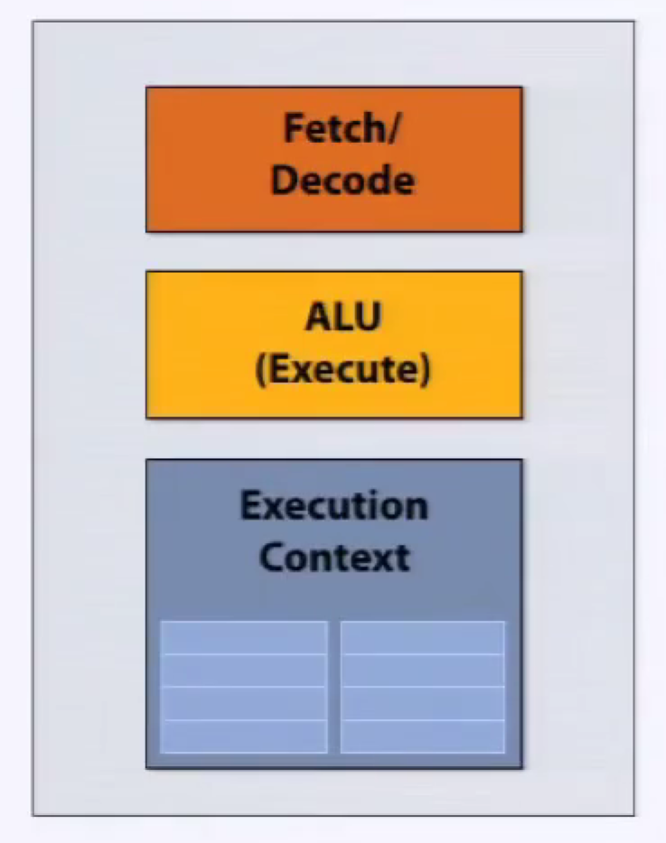

**superscaler execution** 超标量执行，在指令流中，两条指令是独立的，处理器发现并并行处理。

并不是真正意义上的并行，可能采用 pipeline 流水线技术。

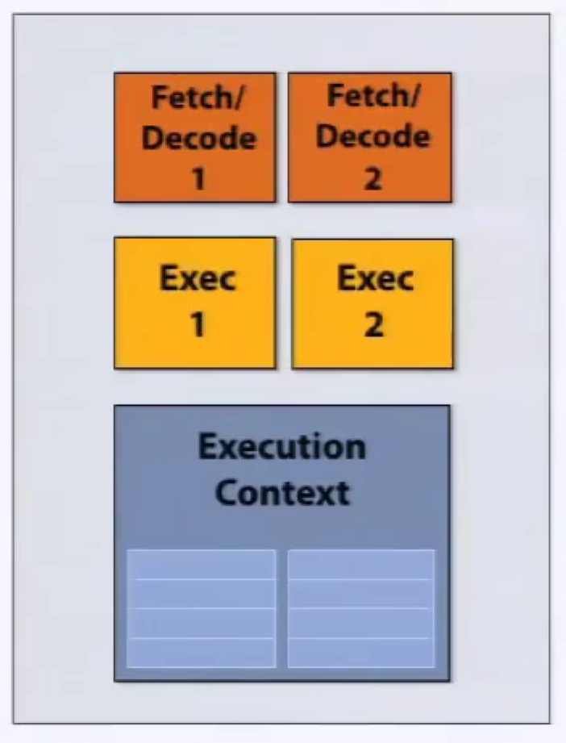

快速单指令流的技术：**内存预取**、**分支预测**、**乱序执行** Out-of-Order Execution, OoOE。

**乱序执行**，Instruction Window **指令窗口**，译码后先放入指令窗口，指令准备所需数据就绪就执行；有序提交，Re-order Buffer **重排序缓冲区**缓存乱序执行的结果，确保正确顺序更新。

这些技术虽然能加速，但也占据了处理器的很大空间，需要不少成本。

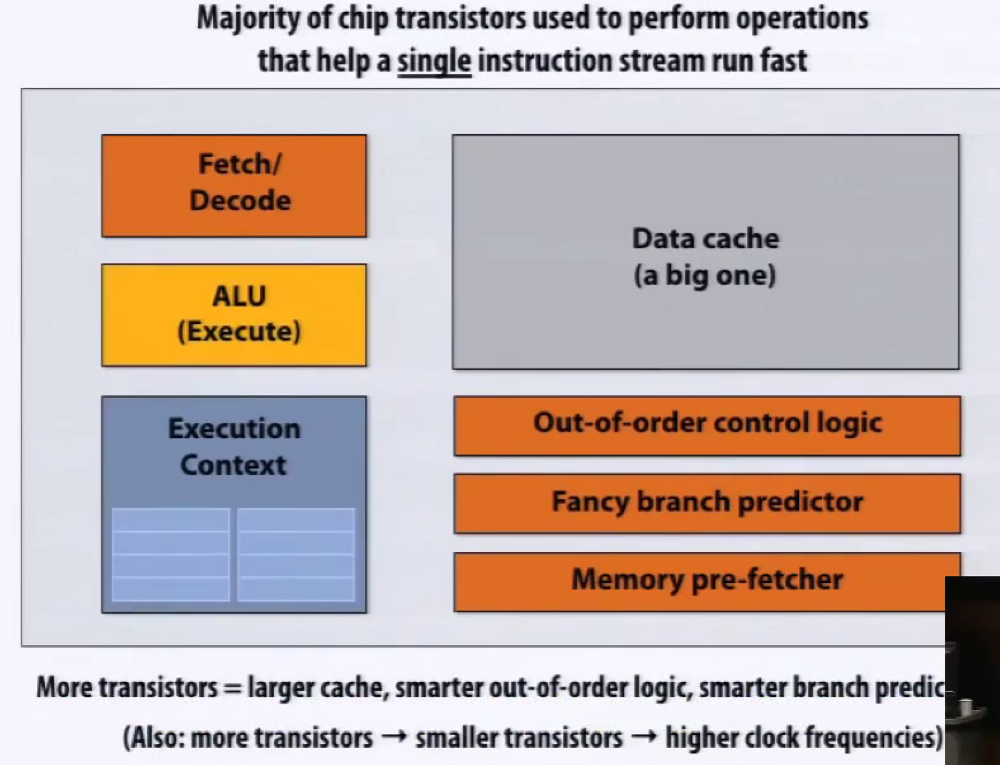

多核处理器如果遇到单指令流程序，不能加速

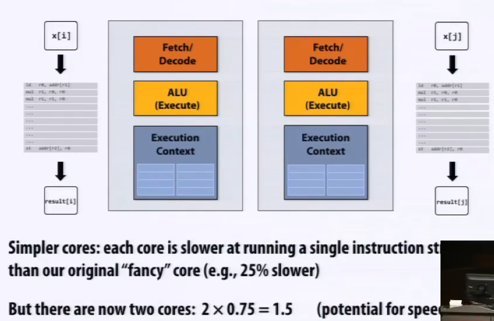

标量程序与向量处理器，并不能加速，需要对应，SSE、AVX 指令，是 SIMD 指令。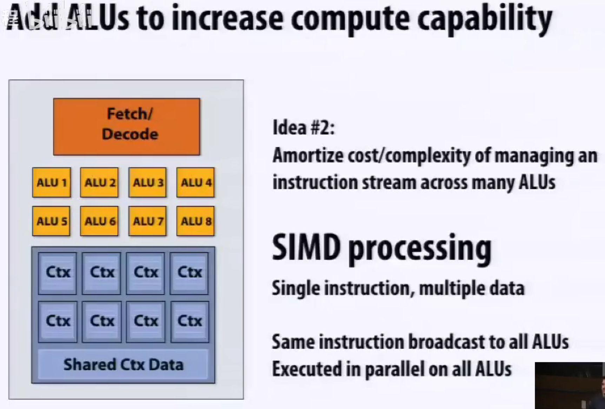

**多核**和**SIMD**是正交的，可以结合。

多核、多线程、多核执行与SIMD执行，有区别，SIMD 需要**共享指令流**。

现代的非朴素的编译器，只有在判断条件符合的时候，才会尝试给执行里面的内容。

**术语** Terminology

-   Instruction stream coherence **指令流一致性**

    一些列不同的逻辑序列能共享相同的指令流，有指令流一致性，在 SIMD 架构下运行的很好。

-   Divergent execution **发散执行**

    缺乏一致性。

-   cache coherence **缓存一致性**

SIMD on CPUs，显式的。

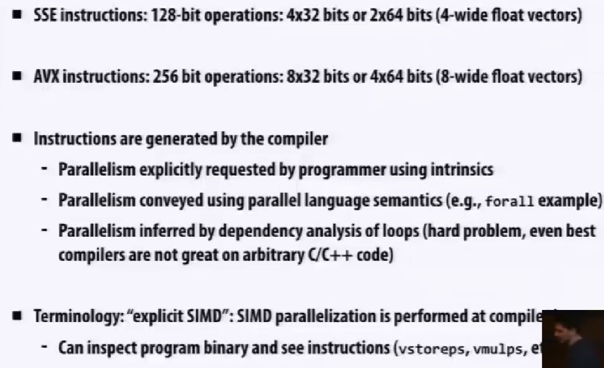

SIMD on GPUs，隐式的，更高层级的抽象。

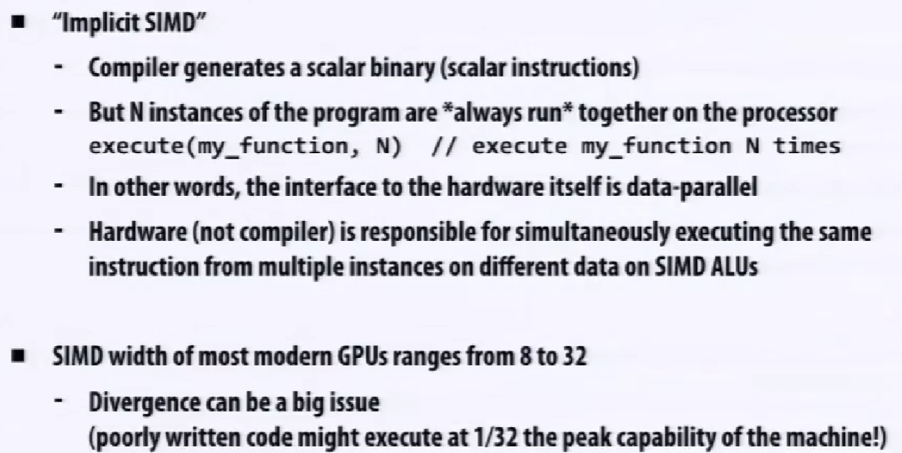

描述机器，X **cores**, Y SIMD ALUs per core (**SIMD width**)

$FLOPS = Frenquency(Hz) \cross Cores \cross SIMD width \cross MAD$

A核B宽SIMD 与 B核A宽SIMD：指令流在 8 条一组下的一致性，可能不如 4 条一组。

**总结**

若干并行运算的方式：

-   **Multi-core**，多核，多处理核

    thread-level 线程级并行（不同指令流在不同核上）

    软件决定什么时候创建线程 e.g. pthreads

-   **SIMD**，多ALUs，被同一条指令流控制（within a core）

    为 data-parallel 数据集并行设计，控制的开销被 ALUs 均摊

    向量化被编译器（显式SIMD）、runtime 运行时完成。

    需要被说明，或者需要被高级编译器的循环分析

-   **Superscalar**，超标量，利用一条指令流的 ILP 指令级并行(within a core)

    硬件自动、动态的并行化。

    超标量架构的CPU核心本身在一个时钟周期内就能执行多条指令。

（增加资源来提高峰值计算）

### Part 2: accessing memory

**术语**，Terminology

-   **Memory latency**，内存延迟

    内存请求的总时间，存/取。

    **latency** 延迟是衡量某时间所需时间长短的指标。

    e.g. 更快的车、更高的限速标准。

-   **Memory bandwidth**，内存带宽

    **bandwidth** 带宽是单位时间内发生多少事情的指标。

    e.g. 增加车道。

（两者的相关性取决于重叠处理程度）

**stalls**，在有依赖先前的指令的时候，处理器需要停顿。

比如，内存读流水线并行，可以提高带宽，但因为对比很长的读取周期，延迟可能没有太多变化。

**cache**，把**降低内存加载的延迟**，length of stalls（reduce latency）

**prefetch**，减少 stalls（**hides** latency）

用 **multi-threading** 多线程来隐藏 **stalls** 停顿，切换线程；各自的寄存器组，对应各自的执行上下文，即可以在**同一处理器**下运行**多条指令流**。

缓解等待耗时长的操作（e.g. 内存访问），处理器的空闲时间变少了，处理器性能发挥得更加充分。

和 OS 的切换概念是相同的，机制是不同的，如果让 OS 来管理这个切换，开销大。

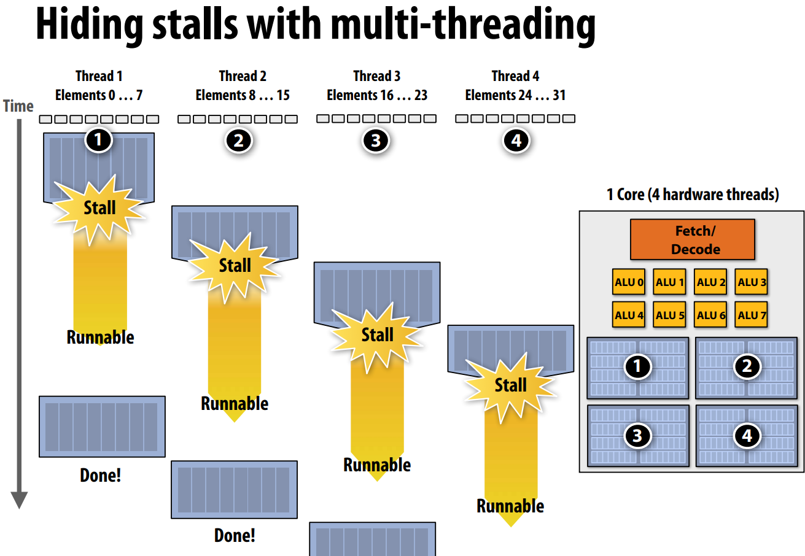

问题：上下文存储空间是有限的，Trade off。

更多但更小的上下文（更强的**延迟隐藏**能力）

更少但更大的上下文（更大的 L1 cache）

没有增加计算资源，提高了高效利用资源的能力。

这种模式有多个不同的版本：

-   **Interleaved multi-threading** (a.k.a. tmporal multi-threading) 交叉多线程 / 时间多线程

    前面提到的技术

-   **Simultaneous multi-threading** (SMT) 同时多线程 / 同步多线程

    每个时钟周期，核心从多个线程中选择指令去在 ALU 上运行

    superscalar 的设计的扩展

    e.g. Intel Hyper-threading (2 threads per core)

**多线程**的代价，假定 cache 没用，不是**降低延迟**，是通过做别的事情来**隐藏延迟**。

这也是 GPU 每个核心有很强的计算能力、很多线程，但是只有不大的缓存。

CPU 的每个核心有两个线程。

CPU 的设计是为了降低延迟；GPU 的设计是精细设计、减小 cache 体积，使得能集成大量的 ALU 来计算。

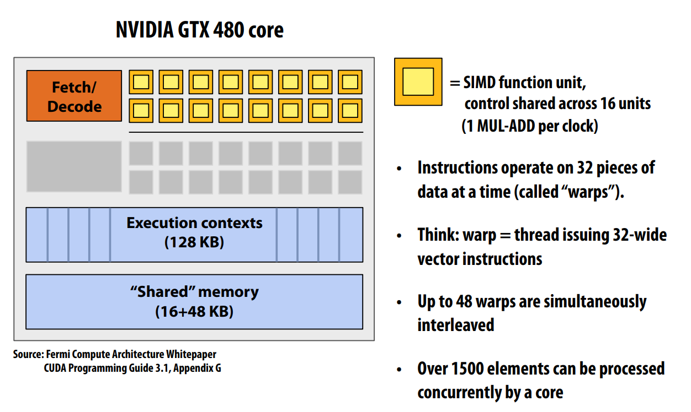

一个 Warp 的完整上下文，实际上是：

1 个程序计数器 (PC) 和 32 组通用目的寄存器 (General-Purpose Registers, GPRs)，每个线程独享一组。

48 个交叉 warp 是 48 个执行上下文。

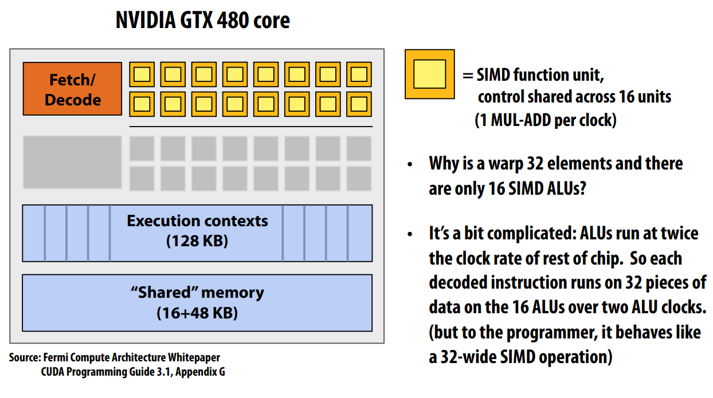

ALU 运行在两倍于芯片其他部分的时钟频率，所以，相当于是 32。

这个是 **hot clocking** (**shader clock**)，但因为能耗太高，下一代架构就砍掉了（x

**思维实验**

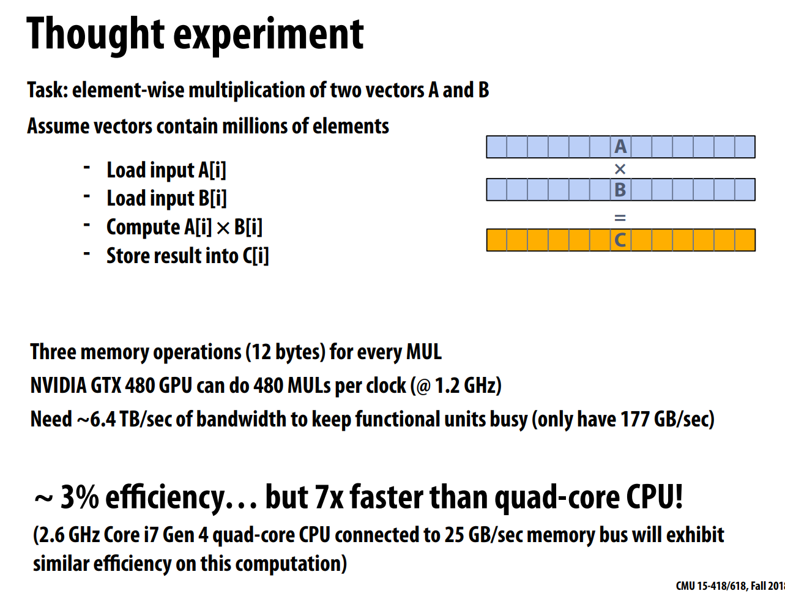

是不是一个好的并行程序。

pros: 可 SIMD，可利用多核，不可以隐藏延迟（？）

cons: 所需的内存带宽太大了，每个计算所产生的内存访问需要大大超出了现在的计算机设计。

实际上，由于内存带宽限制，在 CPU 与 GPU 上跑得差不多。

一个周期的 MADs $Core \cross SIMD \ function\ units = 15 \cross 32 = 480 $

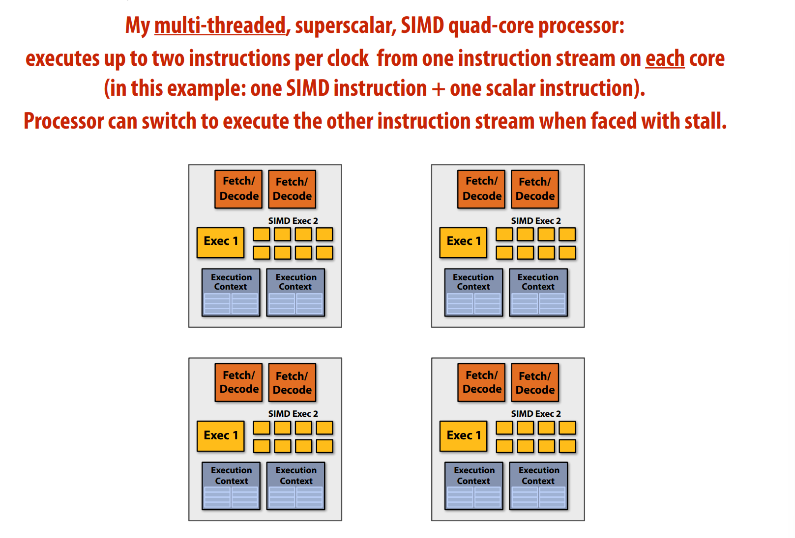

一些**术语**：

-   Multi-core processor
-   SIMD execution
-   Coherent control flow
-   Hardware multi-threading
    -   Interleaved multi-threading
    -   Simultaneous multi-threading
-   Memory latency
-   Memory bandwidth
-   Bandwideth bound application
-   Arithmetic intensity

（高效利用资源）

## Parallel Programming Abstractions

Hyper-threading，超标量 + 多线程。

ISPC **gang abstraction** by SIMD on one core, programming instances

**task abstraction**

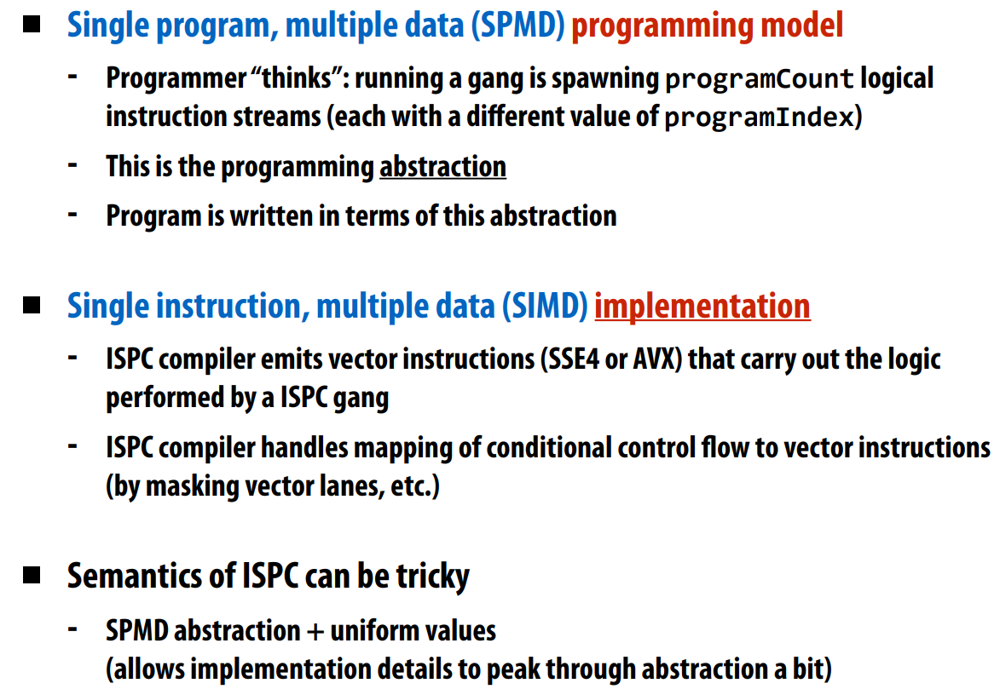

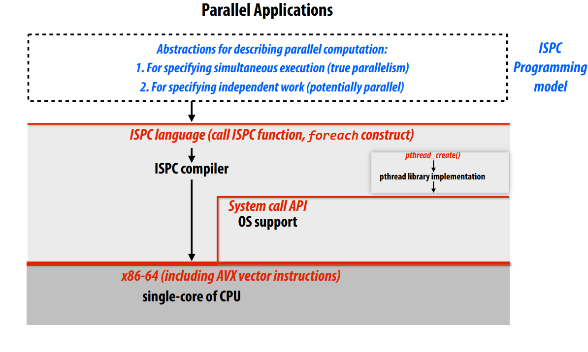

Message passing 信息传递，抽象与实现。

## Parallel Programming Basics

